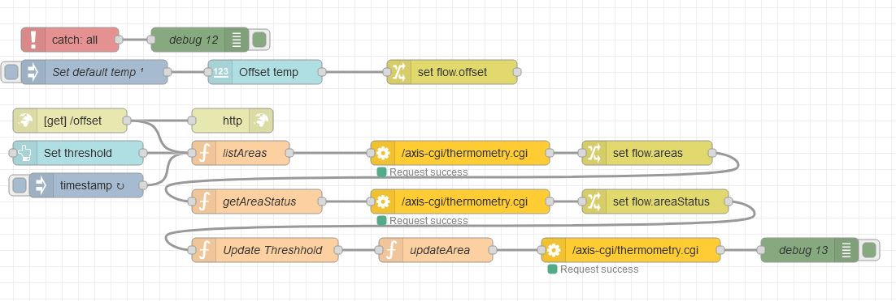
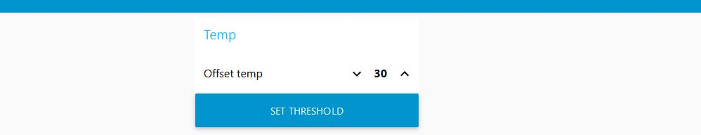

# Flows
A collection of common flows

___
## Modify Axis Device Schedule
Sometimes you need to automate devices schedule settings.  
Required Nodes  
- [node-red-contrib-axis-com](https://flows.nodered.org/node/node-red-contrib-axis-com)
  

  
### [View/copy flow](https://github.com/pandosme/flows/blob/master/flows/ModifyAxisDeviceSchedule.json)

___
## Set Thermal alarm threshhold offset based on normalized temperture
A way to configure the thermal cameras alarm threshold temperture based on the normalized average temperture in areas.  The flow reads out the temperature for all areas and updates
the threshold value the the temperature + a user-defined offset value for each area.  The offset value can be set in the flow or dashboard.
The reconfiguration of threshold can be triggered with a button in the Node-RED dashvoard or by an API.  With the API it is possible to setup a recipient to Node-RED server and trigger the cnfiguration with e.g. a Manual-Input-Button in the camera. 

Required Nodes  
- [node-red-contrib-axis-com](https://flows.nodered.org/node/node-red-contrib-axis-com)
  

  
### [View/copy flow](https://github.com/pandosme/flows/blob/master/flows/ThermalTresholdOffset.json)
