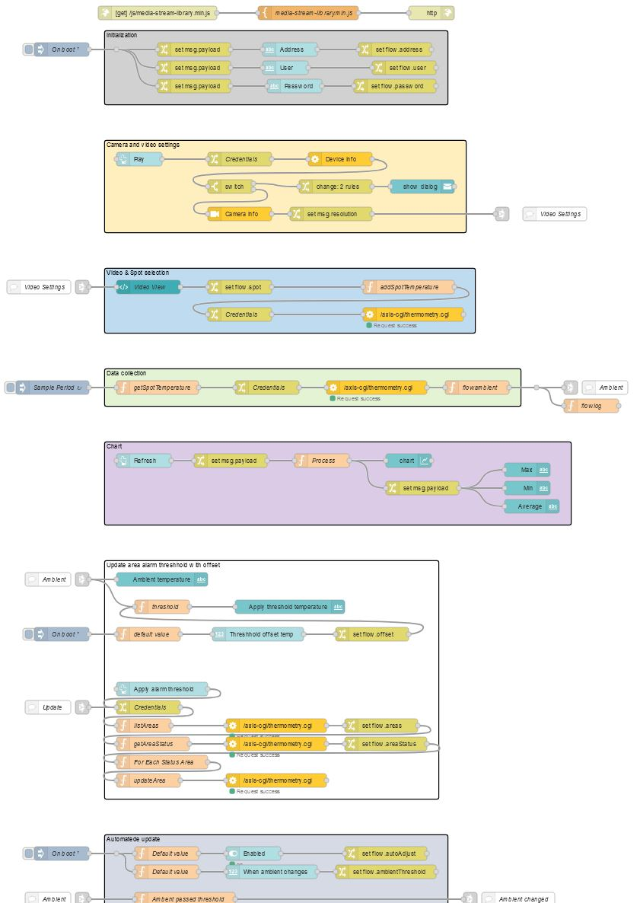

# CamFlows
A collection of flows that can solve various integration and administration use cases with Axis Cameras.  Node-RED can be hosted on any device, [including on the camera](https://pandosme.github.io/acap/node-red/2023/09/12/nodered-acap.html)  
  

___
## Monitor Thermal camera temperature variations over time
A way to configure the thermal cameras alarm threshold temperture based on the normalized average temperture in areas.
* Monitor ambient temperture changes over time to understand how it fluctuates
* Set all the area alarm threshold temperture based on the ambient temperature and a user-defined offset
* Automatically change the area alarm threshold when the ambient temperature changes

## Prerequisite
- Axis Thermal camera
- [Node-RED](https://nodered.org/) installed on a host on the same network as the camera
- Import [node-red-dashboard](https://flows.nodered.org/node/node-red-dashboard) to your Node-RED.
- Import [node-red-contrib-axis-com](https://flows.nodered.org/node/node-red-contrib-axis-com) to your Node-RED
- Import (Copy/Paste) the [Thermal Monitoring Flow](https://raw.githubusercontent.com/pandosme/CamFlows/master/flows/ThermalMonitoring.json) to your Node-RED

## Limitations
* Supports only a singel thermal camera.  The flow could be extended to support more.
  
### Dashboard

  
### Flow
An overview of the flow.  No adjustments needs to be done in the flow.  

___

## Modify Axis Device Schedule
Sometimes you need to automate devices schedule settings.  

Required Nodes that must be installed:
- [node-red-contrib-axis-com](https://flows.nodered.org/node/node-red-contrib-axis-com)
  

  
### [View/copy flow](https://github.com/pandosme/flows/blob/master/flows/ModifyAxisDeviceSchedule.json)

___
