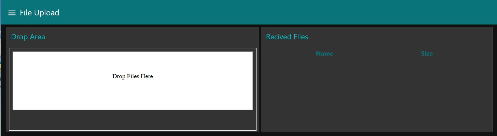
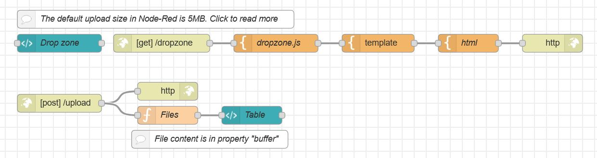

# Dashboard File Upload 
Sometimes you need to upload files to Node-Red.  File dropzones is a convenient way for users.

## Required Nodes
Additional nodes you need to install
- node-red-dashboard

## Dashboard

## Flow

