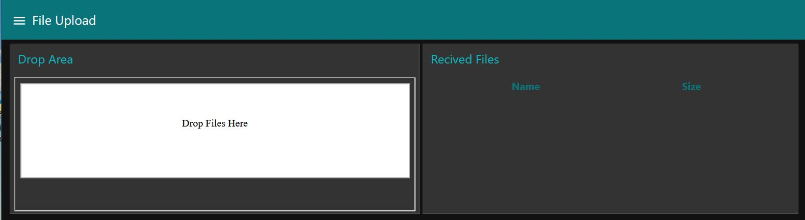
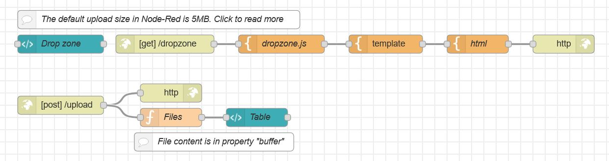

# Dashboard File Upload 
Sometimes you need to upload files to Node-Red.  File dropzones is a concinient way for users.

## Required Nodes
Non-standard nodes you need to install
- 

## Dashboard

## Flow

